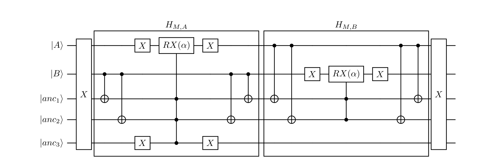
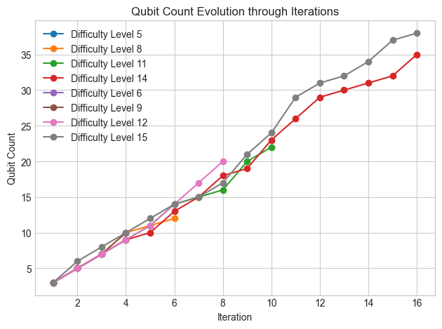

# Quantum-Hybrid Benders Decomposition for Railway Timetable Rescheduling

[](https://www.python.org/)
[](https://www.ibm.com/quantum/qiskit)
[-052FAD?logo=ibm&logoColor=white)](https://quantum.ibm.com/)
[](https://github.com/Z3Prover/z3)
[](#license)

> Industry–academic collaboration: **LMU Munich × Siemens AG × QAR Lab**

## 👥 Team — group project at LMU Munich

> **This was a five-person team project.** All five team members contributed to the design, implementation, experiments, and analysis described below. This repository is mirrored from our group's LMU LRZ GitLab to my personal GitHub for portfolio purposes; the work itself is collective.

| Team member | Affiliation |
| --- | --- |
| **Moritz Heidtmann** | LMU Munich |
| **Andrei Zubarev** | LMU Munich |
| **Daniel Kratzer** | LMU Munich |
| **Kilian Krüger** | LMU Munich |
| **Emanuele Poggi** | LMU Munich |

Per-person contributions are listed in the [Collaboration](#collaboration) section at the bottom of this README.

## Abstract

> Railway operators must restore safe, minimally delayed timetables within
> minutes after disruptions, yet traditional monolithic mixed-integer
> models scale poorly as hundreds of trains interact on dense networks. We
> address this by proposing a **quantum-hybrid Benders decomposition** that
> decouples continuous timing from combinatorial precedence decisions. Our
> framework translates industrial track and schedule data into fixed and
> selectable lower-bound constraints, then uses a Z3-based satisfiability
> sub-problem with "bucketed" deviation predicates as assumptions. Minimal
> unsatisfiable cores serve as Benders cuts in a set-cover master problem,
> which we solve via a **Quantum Alternating Operator Ansatz (QAOA+)**
> implemented with intersection-aware, multi-controlled bit-flip mixers. We
> execute the circuit on IBM's superconducting backends — `ibm_torino`,
> 133 qubits — and evaluate on Siemens's real-world instances with six
> trains over six stations. We benchmark against both classical Benders
> decomposition approaches and a fully centralised classical solver. We
> show that our method **converges in significantly fewer iterations than
> classical baselines, while still producing feasible timetables that
> preserve all safety margins** and operating within currently available
> quantum resources. The primary limitation remains the extended runtime
> on quantum hardware. Our findings highlight the need for further research
> into noise-resilient ansatz design and backend-specific compilation
> techniques to fully unlock the potential of quantum-hybrid decomposition
> methods for rail rescheduling in the NISQ era.

> *Heidtmann, Zubarev, Kratzer, Krüger, Poggi — "Quantum Benders
> Decomposition for Train Rescheduling Problems", LMU Munich, 2025.* See
> [`Siemens_Train_Rescheduling_Gate_Model_FINAL.pdf`](Siemens_Train_Rescheduling_Gate_Model_FINAL.pdf).

## Highlights

- 🧪 **Executed on real quantum hardware** — circuits transpiled and run on
  IBM Quantum's **`ibm_torino`** (Heron, 133-qubit) via the Qiskit Runtime
  `SamplerV2` primitive. Peak problem+ancilla usage in our experiments
  reached **~38 qubits** at the hardest difficulty level — comfortably
  inside the device's 133-qubit budget.
- 🚆 **Benchmarked on a Siemens-provided industrial dataset** — 19 TRP
  instances derived from a Norwegian regional network (**40 connector
  nodes, 47 track segments**), with **6 trains over 6 stations** per
  instance. Difficulty is parameterised by the *earliest access time*
  (`15:32:00 → 15:49:00`, 19 levels of increasing congestion).
- 📉 **Converges in significantly fewer Benders iterations** than the
  classical greedy / Gurobi set-cover masters, especially on the harder
  difficulty levels.
- ✅ **Near-optimal solution quality** — QAOA+ total deviation nearly
  coincides with the centralised Gurobi reference at low-to-medium
  difficulty and shows only marginal excess delay at the hardest levels.
- 🤝 **Industry × academia** — LMU Munich, Siemens AG, and QAR Lab
  contributed problem formulation, data, and quantum-algorithm engineering.

## Architecture

The framework decomposes the TRP into a **classical satisfiability
sub-problem** and a **quantum-assisted set-cover master problem**, exchanged
through Benders cuts.

```
┌──────────────────────────────────────────────────────────────────────────┐
│                       Quantum-Hybrid Benders Loop                        │
│                                                                          │
│   Siemens timetable + network                                            │
│           │                                                              │
│           ▼                                                              │
│   ┌────────────────────────┐                                             │
│   │ io_utils / translator  │   builds (fixed, selectable, deviations)    │
│   └─────────────┬──────────┘                                             │
│                 │                                                        │
│                 ▼                                                        │
│   ┌────────────────────────┐  active deviation predicates  ┌──────────┐  │
│   │   Z3 SAT sub-problem   │ ─────────────────────────────►│  master  │  │
│   │ (bucketed deviations,  │                               │   SCP    │  │
│   │   unsat-core cuts)     │ ◄───── disabled predicates ───│ (greedy /│  │
│   └─────────────┬──────────┘                               │  gurobi /│  │
│                 │                                          │ quantum) │  │
│        SAT  ────┴───►  feasible timetable                  └────┬─────┘  │
│        UNSAT ──►  unsat-core ─► add cut to master               │        │
│                                                                 ▼        │
│                                                ┌─────────────────────┐   │
│                                                │  QAOA-style ansatz  │   │
│                                                │  (qasmsolver.py)    │   │
│                                                │  cost layer + MC    │   │
│                                                │  bit-flip mixer     │   │
│                                                └──────────┬──────────┘   │
│                                                           │              │
│                                            OpenQASM ──►  Qiskit Runtime  │
│                                                           │              │
│                                                  IBM Quantum backend     │
└──────────────────────────────────────────────────────────────────────────┘
```

The control loop is implemented in
[`qcedule/routing.py`](qcedule/routing.py) (`benders_algorithm`):

1. Build a `SatProblem` and an empty `Problem` (set-cover master).
2. Ask Z3 for a schedule under the currently active deviation predicates.
3. If SAT, return the schedule. If UNSAT, take the unsat-core and feed it to
   the master as a new cut.
4. The master returns the minimal set of deviation predicates to **disable**
   in the next round, and the loop repeats.

### Classical components

**Continuous timing sub-problem** —
[`qcedule/satsolving/z3wrapper.py`](qcedule/satsolving/z3wrapper.py).

For each train×station event the wrapper introduces a real-valued arrival
variable $t_{i,s} \in \mathbb{R}_{\ge 0}$ and a deviation slack $\delta_{i,s}
= t_{i,s} - f_{i,s}$ relative to the published time $f_{i,s}$. The origin
event is pinned at $t_{\text{origin}} = 0$. Constraints are encoded as

- **Fixed precedences** (running times along a single train):
  $t_{i,s'} - t_{i,s} \ge f_{(i,s),(i,s')} \quad \forall ((i,s),(i,s')) \in F.$
- **Selectable precedences** (route choices and head-on / overtaking
  conflicts) — for every decision $d \in D$ with choice set $C_d$:
  $\bigvee_{c \in C_d} \bigwedge_{((i,s),(j,s)) \in c}
  t_{j,s} - t_{i,s} \ge f_{(i,s),(j,s)}.$
- **Unambiguity** at stations with multiple candidate platforms — a
  multi-input `Xor` constraint forces exactly one $t_{i,s}$ in the group
  to be non-zero.
- **Deviation buckets** — the published deviation budget $\delta_{\max}$
  is split into a uniform grid of $K$ levels. For each level
  $k \in \{0,\dots,K-1\}$ a Boolean predicate $p_{i,s,k}$ guards
  the upper bound
  $$p_{i,s,k} \implies \big(t_{i,s} - f_{i,s}\big) \le k\,\delta_{\max}/K,$$
  and the always-active clause $t_{i,s} \le f_{i,s} + \delta_{\max}$ caps
  the loosest bucket ($k=K$). The grid is **uniform**; adapting it to
  actual headway distributions or train priorities is one of the
  identified directions for future work.

Z3 is invoked through `solver.check(A)` with a dynamic **assumption list**
$A(B)$ that contains every bucket predicate **not** disabled by the
master. On the initial call $A$ contains only the tightest bucket
$p_{i,s,0}$ per event; later calls include all buckets that have not been
relaxed yet. If Z3 returns **UNSAT**, `solver.unsat_core()` is a subset of
$A$ and therefore references only deviation predicates — these become the
SCP elements for the master cut. The full procedure (Algorithm 1 of the
paper):

```
Algorithm 1 — Z3 sub-problem
INPUT:  disable-set B ⊆ {p_{i,s,k}}
OUTPUT: (sat?, model, unsat-core)

A ← ∅
for each event (i, s):
    for k = K-1 downto 0:
        if p_{i,s,k} ∈ B:  break
        A ← A ∪ { p_{i,s,k} }
res ← solver.check(A)
if res = SAT:    return (true, model, ∅)
if res = UNSAT:  C ← A ∩ solver.unsat_core()
                 if C = ∅: raise EmptyCoreException
                 return (false, ∅, C)
raise RuntimeError "unknown — consider a timeout"
```

Each precedence edge contributes one linear constraint and at most one
literal; total encoding cost is
$|F| + \sum_{d\in D} \max_{c\in C_d}|c| + (K+1)|I_\delta| + |X|$ constraints
and $K|I_\delta|$ Boolean variables, where $X$ counts the XOR ambiguity
constraints. Z3 handles the Boolean–linear mixture with an incremental
CDCL(T) solver.

**Master Set-Cover Problem** —
[`qcedule/setcovering/scpwrapper.py`](qcedule/setcovering/scpwrapper.py).
Each Benders cut is a row in a Boolean DataFrame whose columns are the
deviation predicates seen so far. A column "covers" a row if disabling that
predicate would relax the corresponding unsat-core. Solving the SCP yields
the minimal set of predicates to disable in the next Z3 call. Three solvers
are interchangeable behind the same interface
([`qcedule/setcovering/clsolver.py`](qcedule/setcovering/clsolver.py),
[`qcedule/setcovering/qasmsolver.py`](qcedule/setcovering/qasmsolver.py)):

- `greedy` — `SetCoverPy` greedy heuristic, fast but suboptimal.
- `gurobi` — exact ILP solution, used as the classical reference.
- `quantum` — the QAOA-variant detailed below.

**Centralised baseline** —
[`qcedule/centralized.py`](qcedule/centralized.py) reformulates the whole TRP
as a single Gurobi MILP minimising total deviation. It is the
"do-everything-at-once" reference that the decomposition is benchmarked
against.

### Quantum circuit

The quantum master is a **Quantum Alternating Operator Ansatz (QAOA+)** —
a QAOA variant in the sense of Hadfield et al. — with a problem-tailored
mixer that preserves SCP feasibility. The circuit is constructed in
PennyLane, exported to OpenQASM 2, and executed through Qiskit Runtime on
hardware
(`qcedule/setcovering/qasmsolver.py`,
[`qcedule/setcovering/qasmrun.py`](qcedule/setcovering/qasmrun.py)).

A QAOA+ layer alternates the cost and mixer unitaries

$$\Big(e^{-i\beta_p H_M} e^{-i\gamma_p H_C}\Big) \cdots
\Big(e^{-i\beta_1 H_M} e^{-i\gamma_1 H_C}\Big),$$

starting from a *trivially feasible* initial state — the all-ones
bitstring, "everything selected" — which is itself a cover. Because the
mixer only allows transitions inside the feasible subspace, every
intermediate state is also a valid cover, so we can drop coverage
penalty terms from $H_C$.

**Cost Hamiltonian.** $H_C = \sum_i Z_i$ — the diagonal cost penalises
active qubits ($Z|1\rangle = -|1\rangle$), biasing samples toward
fewer-subset covers. The paper writes the cost evolution per wire as
`RZ(2γ)` (matching `exp(-iγZ)` under PennyLane's `RZ(φ) = exp(-iφ/2·Z)`
convention); the implementation in `qasmsolver.cost_layer` passes `γ`
directly, which is equivalent up to a 2× rescaling of the angle range
COBYLA learns over.

**Intersection-aware multi-controlled bit-flip mixer**
($H_M(\alpha)$, contributed by D. Kratzer; closely follows §A.2.5 of
Hadfield et al.). $H_M$ decomposes into one *partial mixer* $H_{M,S_j}$
per subset $S_j$. To preserve feasibility, $S_j$ is allowed to flip
**only when every element it contains is already covered by some other
selected subset**. For each element $i \in S_j$ we compute on an ancilla
the disjunction
$\bigvee_{l:\, i\in S_l \land l\ne j} x_l$
(implemented with a single multi-controlled X surrounded by basis-flipping
X gates — De Morgan), apply a multi-controlled `RX(α)` on the qubit of
$S_j$ with all element ancillas as controls, and uncompute the ancillas
with the mirrored chain. Partial mixers are applied sequentially in the
order subsets were added to the SCP during Benders iterations.

The figure below (Fig. 3 of the paper) shows the resulting circuit for
the toy SCP instance $\{A=\{1,2,3\},\ B=\{1,2\}\}$:



A static rendering of an *actual* transpiled circuit on `ibm_torino`
is checked in as [`circ.png`](circ.png) (raw OpenQASM in
[`circ`](circ)).

**Parameter optimisation.** SciPy `COBYLA` minimises the Hamming-weight
estimator `count_cost` directly on the bitstring counts (a Monte-Carlo
proxy of the QAOA cost expectation). Default budget per Benders
iteration: `depth=2`, `shots=10`, `maxiter=10`.

**Decomposition for hardware.** Before transpilation we decompose to
`{RX, RY, RZ, CNOT, Toffoli, X}` via `pennylane.transforms.decompose`,
which keeps the gate count low enough for the IBM coupling map. Qiskit's
preset pass manager (level 1) then maps onto a real backend
(`ibm_torino` is hard-coded in `qasmrun.run_circ`; swap as needed).

**Scalability.** One *problem qubit* per SCP subset and one *element
ancilla* per conflict, so qubit count grows near-linearly in the SCP
size. Each Benders iteration adds at least one element (one ancilla),
and possibly new subsets too. Mixer depth depends on the number of
subsets in the SCP and, for each partial mixer, linearly on $D_j$ — the
number of subsets that intersect with $S_j$ in the constraint graph
(see §IV.B.7 of the paper).

## Repository structure

```
quantum-benders-train/
├── qcedule/                         # main Python package
│   ├── routing.py                   # Benders driver (benders_algorithm, central_algorithm)
│   ├── centralized.py               # Gurobi MILP baseline
│   ├── config.py / config.toml      # global constants
│   ├── circuit.py                   # PennyLane reference QAOA circuit (illustrative)
│   ├── mock_circuit.py              # smoke-test ansatz for hardware connectivity
│   ├── io_utils/
│   │   ├── file_parser.py           # network/train file reader
│   │   ├── trains.py                # Train / StopEntry data classes
│   │   ├── routing_areas.py         # k-edge-connected component decomposition
│   │   ├── paths.py                 # all-paths enumeration & area paths
│   │   ├── orderings.py             # head-on / overtaking conflict detection
│   │   ├── translator.py            # Siemens data → (fixed, selectable, deviations)
│   │   └── routes_generator.py      # synthetic linear-corridor instances
│   ├── satsolving/
│   │   └── z3wrapper.py             # SatProblem (bucketed deviations + unsat cores)
│   ├── setcovering/
│   │   ├── scpwrapper.py            # DataFrame SCP wrapper
│   │   ├── clsolver.py              # greedy + Gurobi solvers
│   │   ├── qasmsolver.py            # QAOA driver (PennyLane → OpenQASM)
│   │   ├── qasmrun.py               # Qiskit Runtime SamplerV2 execution
│   │   ├── fetch_result.py          # post-hoc job-result fetcher
│   │   ├── q_test.py                # hardware connectivity smoke test
│   │   ├── qcsolver.py              # deprecated PennyLane-direct path
│   │   └── qiskitsolver.py          # deprecated Qiskit-direct path
│   └── experiments/
│       ├── data.py                  # Result dataclass + pickle helpers
│       └── exp_framework.py         # run_benders_experiment, plot_metric, plot_qubits
├── data/                            # Siemens & toy network/train files
├── results/                         # pickled benchmark Result objects
├── logs/                            # transpiled model.lp, JSON dumps
├── tests/                           # unit tests (pytest / unittest)
├── notebooks/walkthrough.ipynb      # narrative walkthrough of the pipeline
├── modelling.ipynb                  # end-to-end demo notebook
├── plots.ipynb / plotting.ipynb     # figure generation
├── circ / circ.png                  # transpiled hardware circuit (qasm + image)
├── qubitsevolution.png              # qubit count vs. Benders iteration
├── docs/mixer_example.png           # paper Fig. 3 (toy SCP mixer)
├── Siemens_Train_Rescheduling_Gate_Model_FINAL.pdf  # the paper
├── pyproject.toml / requirements.txt
└── README.md
```

## Results

### Dataset

We benchmark on **19 TRP instances** derived from a Norwegian regional
network dataset provided by Siemens. Each instance corresponds to a
disruption scenario — e.g. a temporary network shutdown — characterised by
an **earliest access time** after which all trains may re-enter the
network.

- **Network topology:** 40 connector nodes, 47 track segments, each
  annotated with maximum speed and segment length
  (`data/network_OEOEB.txt`).
- **Train schedules:** 6 stations and 6 trains per instance, each defined
  by ordered stop events at specified stations
  (`data/train_OEOEB.txt`).
- **Difficulty knob:** earliest access time mapped to a difficulty level
  0–18. Later access times mean trains have less time to reach their first
  stops, so more conflicts are generated.

### Solver strategies compared

| Strategy | Role | Engine / parameters |
| --- | --- | --- |
| `centralized` | Reference: solves the *whole* TRP at once. | Gurobi 9.1 with continuous timing variables, deviation slacks, binary platform indicators, all precedence + unambiguity constraints. |
| `greedy`      | Benders master, classical heuristic. | `SetCoverPy` greedy column-selection — fastest but suboptimal. |
| `gurobi`      | Benders master, classical exact. | Gurobi 9.1 binary LP, `MIPGap=0`, no time limit — provably minimal cover. |
| `quantum` (QAOA+) | Benders master, quantum-hybrid. | PennyLane circuit (depth `p=2`), 2p `(γ, β)` parameters optimised by **COBYLA** with `maxiter=10` and `shots=10` per evaluation, transpiled at level 1, executed on **AerSimulator** *and* **`ibm_torino`** (`128` shots, up to 5 retries on transient runtime errors). |

The four pipelines share an identical SCP front-end: the same Z3 sub-
problem produces the same cuts, only the master changes. Raw `Result`
objects are pickled per constraint-difficulty bucket in `results/`; the
aggregate plots are produced by
`qcedule.experiments.exp_framework.plot_metric` and `plot_qubits` over
the metrics `time`, `iter_num`, `total_dev`, `rel_dev`, `max_qubits`.

### Reported metrics

- **Wall-clock runtime** — end-to-end time including master-loop solves
  and circuit execution. Hardware-queue delays are subtracted so that
  reported times reflect compute, not IBM scheduling latency.
- **Number of Benders iterations** — master-loop cycles until the Z3 sub-
  problem reports SAT.
- **Total deviation** — sum of train delays in the rescheduled timetable
  vs. the published one (seconds).
- **Maximum qubit usage** — peak (problem + ancilla) qubits in any
  single iteration.

### Headline findings

**1. Runtime — classical solvers are clearly faster on NISQ hardware.**
Classical runtimes grow predictably with difficulty (see `plots.ipynb`).
Greedy is the fastest at every level; Gurobi-master adds moderate cost;
the centralised Gurobi MILP exhibits the **highest** runtime at medium-to-
hard difficulty. Quantum runtimes are substantially higher: on the local
simulator, time grows sharply with circuit depth × shot count × COBYLA
iterations; on hardware, transpilation, network latency, and job
execution overhead dominate. **This is the primary current limitation of
the approach.**

**2. Solution quality — QAOA+ is on par with classical Benders.**
The centralised Gurobi solver provides the benchmark minimum deviation.
Both decomposed solvers (classical and quantum) show larger delays at the
hardest difficulties. **QAOA+ deviations nearly coincide with the
classical-Benders curves at low and medium difficulty, with only marginal
excess delay at the highest levels.** Schedules from every method respect
all precedence and unambiguity constraints — i.e. all returned timetables
are feasible and preserve safety margins.

**3. Iteration count — QAOA+ converges in significantly fewer Benders
rounds.** This is the headline algorithmic result. On the hardest
instances QAOA+ (both simulator and hardware) needs *far fewer* master-
loop iterations than the greedy or Gurobi master. The mechanism is
*counter-intuitive*: limited circuit depth (p=2), shot noise, and the
short COBYLA budget bias the QAOA+ output distribution toward selecting
**slightly larger relaxation sets** than strictly necessary. With more
constraints disabled per round, the SMT solver encounters fewer fresh
incompatibilities, so the decomposition terminates in fewer iterations.
Gurobi and greedy, in contrast, return tight (often minimal) covers, so
many constraints stay active, more conflicts surface, and cut generation
must repeat. As Leutwiler & Corman observed for railway timetabling [3],
*minimality of the master cover is not strongly correlated with schedule
quality* — even near-random or heuristic covers can yield similar total
deviations to an optimal cover.

**4. Qubit usage — well within current NISQ budgets.**



Per-iteration qubit count is plotted in `qubitsevolution.png` for
difficulty levels 6, 9, 12, 15. As more conflicts are added, the SCP
gains rows (element ancillas) and possibly columns (subset qubits),
yielding a near-linear growth in total qubits over Benders iterations.
**Peak usage rises to about 38 qubits at difficulty level 15 — well below
the 133-qubit capacity of `ibm_torino`.** Allocating additional hardware
runtime would extend the experiments to even higher difficulties.

### Trade-off summary

| Metric | Centralised (Gurobi) | Greedy master | Gurobi master | QAOA+ master |
| --- | --- | --- | --- | --- |
| Solution quality (`total_dev`) | **best (reference)** | comparable | comparable | near-optimal, marginal excess at hardest levels |
| Wall-clock runtime | highest among classical | **fastest** | moderate | substantially higher (NISQ overhead) |
| Benders iterations | n/a (single solve) | high, grows with difficulty | high, grows with difficulty | **fewest** on hard instances |
| Peak qubits | n/a | n/a | n/a | up to ~38 (≤ 133-qubit budget) |
| Feasibility / safety | preserved | preserved | preserved | preserved |

The headline contribution is therefore not a wall-clock win — it is the
combination of **iteration efficiency** with **NISQ-feasible qubit
budgets** and **near-optimal solution quality**: as quantum hardware
matures and per-circuit overhead drops, the iteration-count advantage of
QAOA+ should translate into actual runtime gains, while the algorithmic
structure scales linearly in qubits with problem size.

## Installation

The project ships a `pyproject.toml` with `setuptools` packaging. The
recommended setup uses [uv](https://github.com/astral-sh/uv):

```bash
uv sync
```

This will create a `.venv/`, install all pinned dependencies from
`requirements.txt`, and install the local `qcedule` package in editable
mode. Manual `pip` works too:

```bash
python -m venv .venv && source .venv/bin/activate
pip install -r requirements.txt
pip install -e .
```

To run on real IBM hardware, copy the token template and fill in your IBM
Quantum API key:

```bash
cp .env.copy_and_fill_token .env
# then edit .env: QUANTUM_IBM_TOKEN=...
```

A simulator-only run does **not** require the token.

### Running the algorithm

```python
from qcedule.io_utils.file_parser import parse_network_file, parse_train_file
from qcedule.io_utils.translator import build_constraints
from qcedule.routing import benders_algorithm

trains = parse_train_file("data/train_OEOEB.txt")
G      = parse_network_file("data/network_OEOEB.txt")
constr = build_constraints(G, trains)

# `risks` enforces the unambiguity (Xor) constraints per train.
risks = {1: [[6, 21], [33, 0], [24, 7], [27, 14], [16, 30]],
         2: [[6, 21], [33, 0], [24, 7], [27, 14], [16, 30], [17]],
         # ...
         }

result = benders_algorithm(
    constr,
    platforms=risks,
    scp_strat="quantum",     # "greedy" | "gurobi" | "quantum"
    depth=2, steps=15, order=True,
)
print(result.iter_num, result.total_dev, result.max_qubits)
```

To reproduce the benchmarks, see
`qcedule.experiments.exp_framework.run_benders_experiment` /
`run_centralized_exp` and the `plots.ipynb` notebook.

## Hardware notes & limitations

- **Backends.** Hardware runs use **`ibm_torino`** (Heron, 133 qubits)
  through Qiskit Runtime; the code path also accepts any backend exposed
  by the user's IBM Quantum account. A `FakeBrisbane` noise model from
  `qiskit-ibm-runtime` is available for noisy-simulator experiments.
- **QAOA+ defaults.** `depth=2`, `shots=10` and `maxiter=10` for the
  COBYLA parameter optimiser, then `128` shots (with up to 5 retries on
  `RuntimeJobFailureError`) for the final hardware sample. These are the
  values used in the paper; they reflect a deliberate trade-off between
  per-iteration runtime and noise tolerance, not optimised hyper-
  parameters.
- **Qubit footprint.** One problem qubit per SCP subset plus one ancilla
  per conflict element. Peak observed usage was ~38 qubits at the hardest
  difficulty level — well under the 133-qubit ceiling. Larger instances
  would benefit from a more ancilla-frugal mixer Hamiltonian, an obvious
  next step.
- **Wall-clock.** End-to-end runtime is dominated by IBM queue waits and
  pass-manager transpilation, not gate execution. We subtract queue time
  from `Result.time` (`get_queuetime` in `routing.py`) so reported
  wall-clock numbers reflect compute, not scheduling latency. Even after
  this correction, quantum runtime is **much higher** than the classical
  baselines on every instance — the principal current limitation of the
  approach.
- **NISQ regime.** Physical hardware suffers from decoherence, read-out
  bias, and CNOT infidelity; for denser networks the required circuit
  depth may exceed the device's coherence window. AerSimulator runs are
  noise-free but exponentially slower than hardware on large instances.
- **Mixer cost.** The intersection-aware mixer uses ancillas plus
  `MultiControlledX` chains, which decompose into many CNOTs. We do *not*
  use `noancilla` MCX synthesis on the QAOA path; the trade-off is more
  qubits for shorter depth, which is the right call on Heron.

## References

Bibliography of the paper (`Siemens_Train_Rescheduling_Gate_Model_FINAL.pdf`):

1. Deutsche Bahn AG. *Integrated Report 2024.* https://ibir.deutschebahn.com/2024/, 2024.
2. V. Cacchiani, D. Huisman, M. Kidd, L. Kroon, P. Toth, L. Veelenturf, J. Wagenaar.
   *An overview of recovery models and algorithms for real-time railway
   rescheduling.* Transportation Research Part B, 63:15–37, 2014.
3. F. Leutwiler, F. Corman. *Set covering heuristics in a Benders
   decomposition for railway timetabling.* Computers & Operations Research,
   159:106339, 2023.
4. E. Farhi, J. Goldstone, S. Gutmann. *A Quantum Approximate Optimization
   Algorithm.* arXiv:1411.4028, 2014.
5. F. Leutwiler, F. Corman. *A logic-based Benders decomposition for
   microscopic railway timetable planning.* European Journal of
   Operational Research, 303(2):525–540, 2022.
6. S. Hadfield, Z. Wang, B. O'Gorman, E. G. Rieffel, D. Venturelli, R. Biswas.
   *From the Quantum Approximate Optimization Algorithm to a Quantum
   Alternating Operator Ansatz.* Algorithms, 12(2):34, 2019.
7. J. E. Beasley. *Algorithms for unconstrained two-dimensional guillotine
   cutting.* Journal of the Operational Research Society, 36(4):297–306,
   1985.
8. E. Balas, A. Ho. *Set covering algorithms using cutting planes,
   heuristics, and subgradient optimization.* Combinatorial Optimization,
   pp. 37–60, 1980.
9. V. Chvátal. *A greedy heuristic for the set-covering problem.*
   Mathematics of Operations Research, 4(3):233–235, 1979.
10. J. F. Benders. *Partitioning procedures for solving mixed-variables
    programming problems.* Computational Management Science, 2(1), 2005.
11. C. Grange, M. Poss, E. Bourreau. *An introduction to variational
    quantum algorithms for combinatorial optimization problems.* 4OR,
    21(3):363–403, 2023.
12. C. Grange. *Design and application of quantum algorithms for railway
    optimisation problems.* PhD thesis, Université de Montpellier, 2024.
13. K. Domino, E. Doucet, R. Robertson, B. Gardas, S. Deffner. *On the
    Baltimore Light RailLink into the quantum future.* arXiv:2406.xxxxx,
    2024.
14. L. de Moura, N. Bjørner. *Z3: An Efficient SMT Solver.* TACAS, LNCS
    4963:337–340, Springer, 2008.
15. P. Virtanen et al. *SciPy 1.0: Fundamental Algorithms for Scientific
    Computing in Python.* Nature Methods, 17:261–272, 2020.
16. M. A. Nielsen, I. L. Chuang. *Quantum Computation and Quantum
    Information.* Cambridge University Press, 2010.
17. Gurobi Optimization, LLC. *Gurobi Optimizer Reference Manual,*
    9.1 ed., 2020.
18. G. Zhu. *SetCoverPy: A heuristic solver for the set cover problem.*
    Astrophysics Source Code Library, ascl–2203, 2022.

## Collaboration

Developed in collaboration with **Siemens AG** and the **QAR Lab** at LMU
Munich as part of the *Quantum Computing Practical* course at
**Ludwig-Maximilians-Universität München (LMU)**, summer term 2025.
Migrated from the LMU LRZ GitLab to GitHub for portfolio purposes.

**Authors.**

- Moritz Heidtmann — SCP wrapper, plotting, relative-delay metric.
- Andrei Zubarev — toy modelling, constraint construction (`translator.py`),
  QAOA framework, cost layer, hardware/simulator experiments.
- Daniel Kratzer — classical SCP solvers, centralised solver, intersection-
  aware multi-controlled bit-flip mixer, OpenQASM execution path, exact TRP
  modelling (orderings, paths, routing areas, trains), experiment & pickle
  infrastructure, repository management.
- Kilian Krüger — config plumbing, QAOA+ parameter optimisation, `Result`
  metrics.
- Emanuele Poggi — Z3 sub-problem (`z3wrapper.py`), IBM Runtime token
  handling, classical experiments.

## License

MIT — see [`LICENSE`](LICENSE) (to be added).
